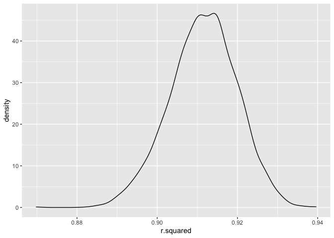

p8105_hw6_mm6410
================
Mahdi Maktabi
2024-12-01

``` r
library(tidyverse)
library(modelr)
```

## Problem 1

``` r
weather_df = 
  rnoaa::meteo_pull_monitors(
    c("USW00094728"),
    var = c("PRCP", "TMIN", "TMAX"), 
    date_min = "2017-01-01",
    date_max = "2017-12-31") %>%
  mutate(
    name = recode(id, USW00094728 = "CentralPark_NY"),
    tmin = tmin / 10,
    tmax = tmax / 10) %>%
  select(name, id, everything())
```

    ## using cached file: /Users/mahdi/Library/Caches/org.R-project.R/R/rnoaa/noaa_ghcnd/USW00094728.dly

    ## date created (size, mb): 2024-12-01 12:05:37.39547 (8.667)

    ## file min/max dates: 1869-01-01 / 2024-11-30

``` r
weather_df =
  weather_df |>
  bootstrap(5000) |> 
  mutate(
    models = map(strap, \(df) lm(tmax ~ tmin, data = df)),
    results = map(models, broom::tidy),
    glance = map(models, broom::glance)
  )
```

### Plotting the R-Squared Distribution

``` r
weather_df |> 
  select(strap, .id, glance) |> 
  unnest(glance) |> 
  select(.id, r.squared) |> 
  ggplot(aes(x = r.squared)) +
  geom_density()
```

<!-- -->

``` r
weather_df |> 
  select(strap, .id, glance) |> 
  unnest(glance) |> 
  select(.id, r.squared) |> 
  pull(r.squared) |> 
  mean()
```

    ## [1] 0.9113248

We can see from the density plot of the R-squared estimates that it is
normally distributed. The mean of the R-squared estimates is 0.911.
