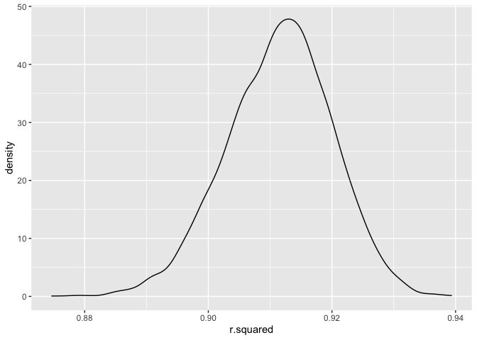
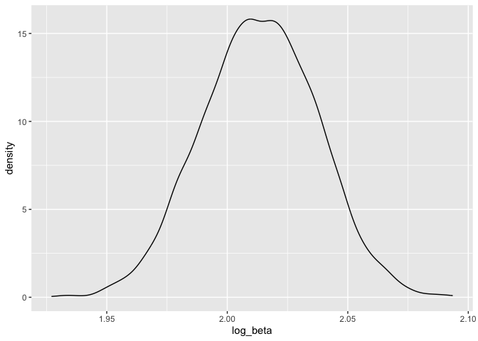
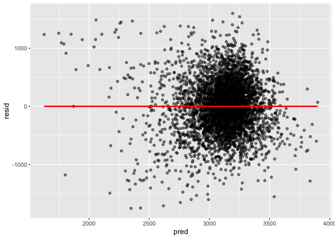

p8105_hw6_mm6410
================
Mahdi Maktabi
2024-12-01

``` r
library(tidyverse)
library(modelr)
```

## Problem 1

``` r
weather_df = 
  rnoaa::meteo_pull_monitors(
    c("USW00094728"),
    var = c("PRCP", "TMIN", "TMAX"), 
    date_min = "2017-01-01",
    date_max = "2017-12-31") %>%
  mutate(
    name = recode(id, USW00094728 = "CentralPark_NY"),
    tmin = tmin / 10,
    tmax = tmax / 10) %>%
  select(name, id, everything())
```

    ## using cached file: /Users/mahdi/Library/Caches/org.R-project.R/R/rnoaa/noaa_ghcnd/USW00094728.dly

    ## date created (size, mb): 2024-12-01 12:05:37.39547 (8.667)

    ## file min/max dates: 1869-01-01 / 2024-11-30

``` r
weather_df =
  weather_df |>
  bootstrap(5000) |> 
  mutate(
    models = map(strap, \(df) lm(tmax ~ tmin, data = df)),
    log_beta = map_dbl(models, ~ {
      coefs = broom::tidy(.x)
      log(coefs$estimate[1] * coefs$estimate[2])
    }),
    glance = map(models, broom::glance)
  )
```

### Plotting the R-Squared Distribution

``` r
weather_df |> 
  select(strap, .id, glance) |> 
  unnest(glance) |> 
  select(.id, r.squared) |> 
  ggplot(aes(x = r.squared)) +
  geom_density()
```

<!-- -->

``` r
weather_df |> 
  select(strap, .id, glance) |> 
  unnest(glance) |> 
  select(.id, r.squared) |> 
  pull(r.squared) |> 
  mean()
```

    ## [1] 0.9114777

We can see from the density plot of the R-squared estimates that it is
approximately normally distributed. The mean of the R-squared estimates
is 0.911.

### Plotting the log($\hat{\beta}_{0}$ \* $\hat{\beta}_{1}$)

``` r
weather_df |> 
  ggplot(aes(x = log_beta)) +
  geom_density()
```

<!-- -->

``` r
weather_df |> 
  pull(log_beta) |> 
  mean()
```

    ## [1] 2.013371

Similarly, we can see from the density plot of the log($\hat{\beta}_{0}$
\* $\hat{\beta}_{1}$) estimates that it is also approximately normally
distributed with a mean of 2.013.

### Finding the 2.5% and 97.5% quantiles

``` r
weather_df |> 
  select(strap, .id, glance) |> 
  unnest(glance) |> 
  select(.id, r.squared) |> 
  summarize(
    ci_low = quantile(r.squared, 0.025),
    ci_up = quantile(r.squared, 0.975)
  )
```

    ## # A tibble: 1 × 2
    ##   ci_low ci_up
    ##    <dbl> <dbl>
    ## 1  0.894 0.927

``` r
weather_df |> 
  summarize(
    ci_low = quantile(log_beta, 0.025),
    ci_up = quantile(log_beta, 0.975)
  )
```

    ## # A tibble: 1 × 2
    ##   ci_low ci_up
    ##    <dbl> <dbl>
    ## 1   1.97  2.06

The 95% CI for the r-squared and log of the estimated intercept \*
slope:

- r-squared: (0.894, 0.928)
- log($\hat{\beta}_{0}$ \* $\hat{\beta}_{1}$): (1.97, 2.06)

## Problem 2

``` r
homicide_df = read_csv(file = "./data/homicide-data.csv", na = c("NA", "", NA, "Unknown"))
```

    ## Rows: 52179 Columns: 12
    ## ── Column specification ────────────────────────────────────────────────────────
    ## Delimiter: ","
    ## chr (8): uid, victim_last, victim_first, victim_race, victim_sex, city, stat...
    ## dbl (4): reported_date, victim_age, lat, lon
    ## 
    ## ℹ Use `spec()` to retrieve the full column specification for this data.
    ## ℹ Specify the column types or set `show_col_types = FALSE` to quiet this message.

``` r
homicide_df =
  homicide_df |> 
  mutate(
    city_state = str_c(city, state, sep = ", "),
    solved = if_else(disposition == "Closed by arrest", 1, 0),
    victim_age = as.numeric(victim_age)) |> 
  filter(
    !city_state %in% c("Dallas, TX", "Phoenix, AZ", "Kansas City, MO", "Tulsa, AL"),
    victim_race %in% c("White", "Black")
  )
```

``` r
baltimore_lm =
  homicide_df |> 
  filter(city_state == "Baltimore, MD") |> 
  glm(solved ~ victim_age + victim_sex + victim_race, data = _, family = binomial()) |> 
  broom::tidy(conf.int = TRUE) |> 
  mutate(
    adj_OR = exp(estimate),
    CI_low = exp(conf.low),
    CI_high = exp(conf.high)
  ) |> 
  filter(term == "victim_sexMale")
```

The estimated OR is 0.426 with a 95% CI (0.324, 0.558).

This means that the estimated odds of solving homicides for male victims
is 0.426 times the odds of solving homicides for female victims,
adjusting for age and race. A range of reasonable estimates for the true
OR is between 0.324 and 0.558.

``` r
all_city_lm =
  homicide_df |> 
    nest(data = -city_state) |> 
    mutate(
    models = map(data, \(df) glm(solved ~ victim_age + victim_sex + victim_race, data = df, family = binomial())),
    results = map(models, \(model) broom::tidy(model, conf.int = TRUE) |> 
                    mutate(
                      adj_OR = exp(estimate),
                      CI_low = exp(conf.low),
                      CI_high = exp(conf.high)
                    ) |> 
                    filter(term == "victim_sexMale"))) |> 
  select(city_state, results) |> 
  unnest(results) |> 
  select(city_state, adj_OR, CI_low, CI_high)
```

Now I will make a plot showing the estimate ORs and CIs for each city:

``` r
all_city_lm |> 
  mutate(city_state = fct_reorder(city_state, adj_OR)) |> 
  ggplot(aes(x = city_state, y = adj_OR)) +
  geom_point() +
  geom_errorbar(aes(ymin = CI_low, ymax = CI_high)) +
  theme(axis.text.x = element_text(angle = 90, hjust = 1))
```

<!-- -->

This plot shows the estimated odds of solved homicides for male victims
compared to female victims for each city, adjusting for age and race.
The majority of the estimated ORs fall between the values of 0 to 1; but
Atlanta GA, Richmond VA, Nashville TN, Fresno CA, Stockton CA, and
Albuquerque NM all have estimated ORs greater than 1.

For the 95% CI, there are many cities that do not include the null value
of 1 (generally the lower ORs). There are also many cities where the 95%
CI have a very wide range and include the null value of 1. For these
cities, the estimated OR that is seen might not be valid as this value
could have been produced due to random chance.

## Problem 3

``` r
birthweight_df = 
  read_csv(file = "./data/birthweight.csv",
           na = c("NA", "", ".")) |> 
  janitor::clean_names() |> 
  mutate(
    babysex = factor(babysex, levels = c(1, 2), labels = c("Male", "Female")),
    frace = case_match(frace,
      1 ~ "White",
      2 ~ "Black",
      3 ~ "Asian",
      4 ~ "Puerto Rican",
      8 ~ "Other"),
    frace = fct_infreq(frace),
    mrace = case_match(mrace,
      1 ~ "White",
      2 ~ "Black",
      3 ~ "Asian",
      4 ~ "Puerto Rican",
      8 ~ "Other"),
    mrace = fct_infreq(mrace),
    malform = factor(malform, levels=c(0,1), labels=c("Absent", "Present"))
    )
```

    ## Rows: 4342 Columns: 20
    ## ── Column specification ────────────────────────────────────────────────────────
    ## Delimiter: ","
    ## dbl (20): babysex, bhead, blength, bwt, delwt, fincome, frace, gaweeks, malf...
    ## 
    ## ℹ Use `spec()` to retrieve the full column specification for this data.
    ## ℹ Specify the column types or set `show_col_types = FALSE` to quiet this message.

Doing some exploratory analysis of different variables:

``` r
birthweight_df |> 
  ggplot(aes(x = gaweeks, y = bwt)) +
  geom_point(alpha = 0.5)
```

<!-- -->

``` r
# generally, as GA increases, birthweight increases and then clusters around 40 weeks.

birthweight_df |> 
  ggplot(aes(x = ppbmi, y = bwt)) +
  geom_point()
```

<!-- -->

``` r
birthweight_df |> 
  ggplot(aes(x = smoken, y = bwt)) +
  geom_point()
```

<!-- -->

``` r
birthweight_df |> count(smoken) # there were quite a number of people who smoked during pregnancy in this dataset
```

    ## # A tibble: 33 × 2
    ##    smoken     n
    ##     <dbl> <int>
    ##  1  0      2552
    ##  2  0.125    39
    ##  3  0.75     38
    ##  4  1       142
    ##  5  2       141
    ##  6  3       144
    ##  7  4       110
    ##  8  5       128
    ##  9  6        61
    ## 10  7        51
    ## # ℹ 23 more rows

Based on my exploratory analysis, I chose to create a model using:

- outcome: birthweight
- Predictor variables: gestational age (`gaweeks`), mother’s
  pre-pregnancy BMI (`ppbmi`), mother’s age at delivery (`momage`), and
  the average number of cigarettes smoked per day during pregnancy.
- I chose these predictors as they all may directly influence a baby’s
  birthweight.

``` r
bwt_model =
  birthweight_df |> 
    lm(bwt ~ gaweeks + ppbmi + momage + smoken, data = _)

bwt_model |> 
  broom::tidy() |> 
  knitr::kable(digits = 3)
```

| term        | estimate | std.error | statistic | p.value |
|:------------|---------:|----------:|----------:|--------:|
| (Intercept) |   52.464 |   101.197 |     0.518 |   0.604 |
| gaweeks     |   65.473 |     2.230 |    29.357 |   0.000 |
| ppbmi       |   12.266 |     2.203 |     5.568 |   0.000 |
| momage      |   12.020 |     1.824 |     6.592 |   0.000 |
| smoken      |   -6.750 |     0.946 |    -7.135 |   0.000 |

``` r
birthweight_df = 
  birthweight_df |> 
  add_predictions(bwt_model) |>  
  add_residuals(bwt_model)

ggplot(birthweight_df, aes(x = pred, y = resid)) + 
  geom_point(alpha = 0.5) + 
  geom_smooth(method = "lm", se = FALSE, color = "red")
```

    ## `geom_smooth()` using formula = 'y ~ x'

<!-- -->

When plotting the residuals vs predicted values, we see that there is a
cluster around 3200. This could mean that I am missing variables from my
model.

``` r
bwt_model_cv =
  crossv_mc(birthweight_df, 200) |> 
  mutate(
    train = map(train, as_tibble),
    test = map(test, as_tibble)
  )

bwt_model_cv =
  bwt_model_cv |> 
    mutate(
      main_effects = map(train, \(df) lm(bwt ~ gaweeks + blength, data = df)),
      model_interaction = map(train, \(df) lm(bwt ~ bhead * blength * babysex, data = df)),
      my_model = map(train, \(df) lm(bwt ~ gaweeks + ppbmi + smoken, data = df))
    ) |> 
  mutate(
    rmse_main_effects = map2_dbl(main_effects, test, \(mod, df) rmse(model = mod, data = df)),
    rmse_interactions = map2_dbl(model_interaction, test, \(mod, df) rmse(model = mod, data = df)),
    rmse_my_model = map2_dbl(my_model, test, \(mod, df) rmse(model = mod, data = df)))
```

``` r
bwt_model_cv |> 
  select(starts_with("rmse")) |> 
  pivot_longer(
    everything(),
    names_to = "model", 
    values_to = "rmse",
    names_prefix = "rmse_"
  ) |> 
  mutate(model = fct_inorder(model)) |> 
  ggplot(aes(x = model, y = rmse, fill = model)) + 
  geom_violin(trim = FALSE, alpha = 0.7) +
  geom_boxplot(width = 0.1, outlier.shape = NA, alpha = 0.5) +
  labs(
    title = "Comparison of RMSE Across Models",
    x = "Model",
    y = "RMSE"
  ) +
  theme_minimal() +
  theme(
    legend.position = "none",
    axis.text.x = element_text(angle = 45, hjust = 1)
  )
```

<!-- -->

Comparing the RMSE across all models, my model has a much higher root
mean square errors. The reason for this might be that the predictors I
chose to include in the model might not as directly related to
birthweight compared to the other models leading to a higher prediction
error. For example, the model with head circumference, length, sex, and
all interactions between these 3 predictors had the lowest RMSE. These
predictors are all generally related to one another in some way and
would be closely related to the baby’s birthweight.
